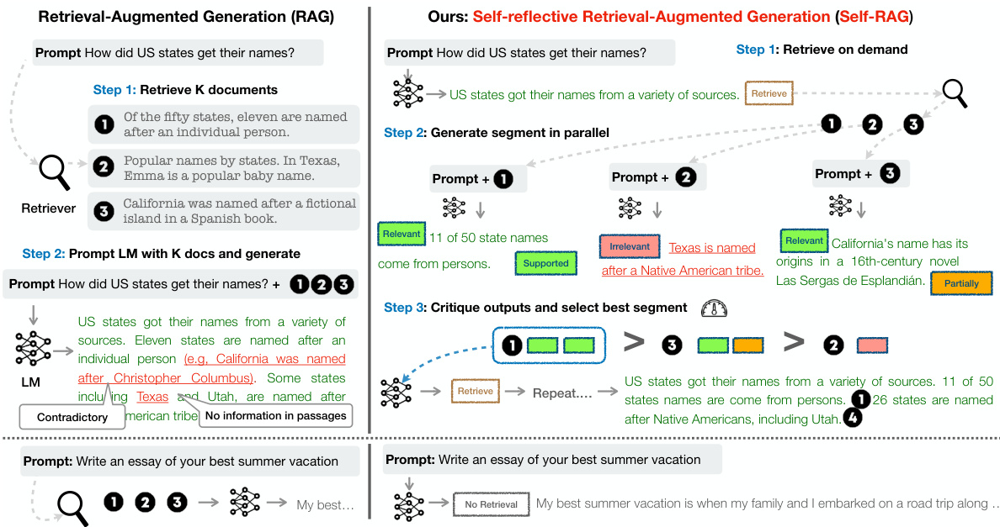
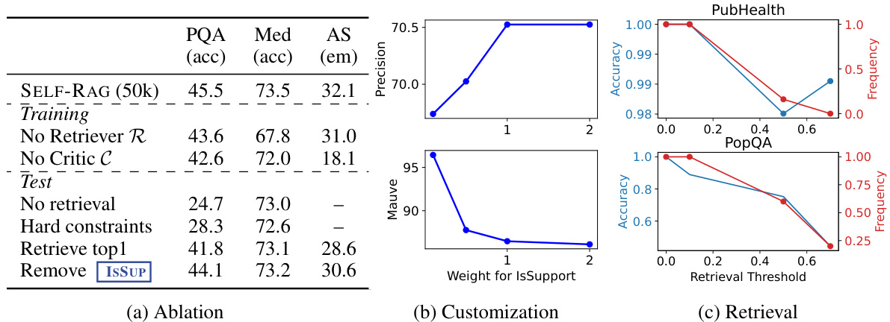
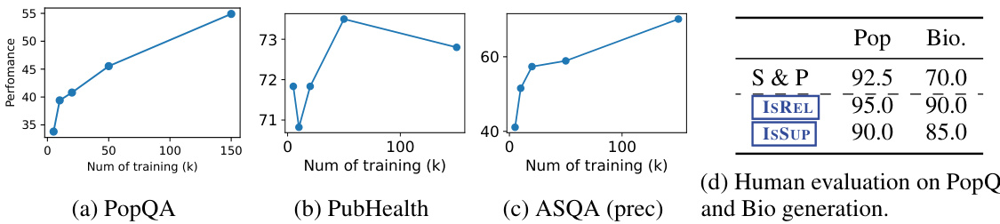

# 自我反思：通过学习检索、生成和批判

Akari Asait, Zeqiu $\mathbf{W_{u}}^{\dagger}$ , Yizhong Wangt\$, Avirup $\mathbf{S}\mathbf{i}\mathbf{l}^{\ddag}$ , Hannaneh Hajishirzi tUniversity of Washington  Allen Institute for AI \*IBM Research AI {akari,zeqiuwu,yizhongw,hannaneh}@cs.washington.edu,avi@us.ibm.com

# 摘要

尽管大型语言模型(LLMs)具有出色的能力，但由于完全依赖其所包含的参数化知识，通常会产生包含事实错误的响应。检索增强生成(RAG)是一种临时方法，通过检索相关知识来增强LM，从而减少这类问题。然而，不加区分地检索和合并固定数量的检索段落，无论是否需要检索或段落是否相关，都会降低LM的多功能性，或导致无益的响应生成。我们提出了一个名为自反思检索增强生成(SELF-RAG)的新框架，通过检索和自我反思来提高LM的质量和准确性。我们的框架训练一个任意的LM，在需求时自适应地检索段落，并使用称为反思标记的特殊标记生成和反思检索段落及其自身生成。生成反思标记使LM在推理阶段可控，使其能够根据不同的任务需求调整其行为。实验证明，SELFRAG(7B和13B参数)在各种任务上明显优于最先进的LLMs和检索增强模型。具体而言，SELF-RAG在开放域QA、推理和事实验证任务上优于ChatGPT和检索增强Llama2-chat，在改善长篇生成的准确性和引用准确性方面相对于这些模型显示出显著的增益。

# 1 引言

尽管大型语言模型(LLMs)在模型规模和数据规模上取得了进展(Mallen等，2023; Min等，2023)，但仍然存在事实错误的问题。检索增强生成(RAG)方法(见图1左; Lewis等，2020; Guu等，2020)通过检索相关段落来增强LLMs的输入，减少了知识密集型任务中的事实错误。然而，这些方法可能会降低LLMs的多功能性，或引入不必要或离题的段落，导致生成质量较低，因为它们不加区分地检索段落，无论事实依据是否有助于生成。此外，由于模型没有明确训练来利用和遵循提供的段落中的事实，生成的结果不能保证与检索到的相关段落一致。本文介绍了一种名为自反思检索增强生成(SELF-RAG)的方法，通过按需检索和自我反思来提高LLM的生成质量，包括其事实准确性，而不损害其多功能性。我们以端到端的方式训练一个任意的LM，使其能够在给定任务输入时反思自身的生成过程，生成任务输出和间歇性的特殊标记(即反思标记)。反思标记分为检索和评论标记，用于指示检索的必要性和生成质量(见图1右)。具体而言，给定一个输入提示和前面的生成结果，SELF-RAG首先确定是否通过检索段落来帮助继续生成。如果是，它会输出一个检索标记，以在需要时调用一个检索模型(步骤1)。随后，SELF-RAG同时处理多个检索到的段落，评估它们的相关性，然后生成相应的任务输出(步骤2)。然后，它生成评论标记，批评自身的输出，并选择在事实性和整体质量方面最佳的输出(步骤3)。这个过程与传统的RAG方法不同，传统方法会无论是否需要检索，始终检索固定数量的文档进行生成(例如，底部图示例不需要事实知识)，而且不会对生成质量进行二次访问。此外，SELF-RAG为每个段落提供引用，并自我评估输出是否得到段落支持，从而更容易进行事实验证。

**

图1：SELF-RAG概述。SELF-RAG学习检索、评论和生成文本段落，以提高整体生成质量、事实性和可验证性。

SELF-RAG训练一个任意的LM，通过将反思标记统一为扩展模型词汇表中的下一个标记预测来生成文本。我们在包含反思标记和检索段落的各种文本集合上训练我们的生成LM。受强化学习中使用奖励模型的启发（Ziegler等，2019; Ouyang等，2022），反思标记由经过训练的评论模型离线插入到原始语料库中。这消除了在训练期间托管评论模型的需要，减少了开销。评论模型在一组由提示专有LM（即GPT-4；OpenAI 2023）引发的输入、输出和相应的反思标记数据集上进行监督训练。虽然我们受到使用控制标记启动和引导文本生成的研究的启发（Lu等，2022; Keskar等，2019），我们训练的LM在生成每个段落后使用评论标记来评估自己的预测，作为生成输出的一个组成部分。

$$ 
{\mathrm{rrfscore}}={\frac{1}{{\mathrm{rank}}+k}}
 $$

 
SELF-RAG进一步实现了一个可定制的解码算法，以满足由反思标记预测定义的硬约束或软约束。特别是，我们的推理时算法使我们能够（1）灵活调整不同下游应用的检索频率，以及（2）通过利用反思标记，通过使用反思标记概率的加权线性和作为段落分数进行段级束搜索，定制模型的行为以适应用户偏好。

六项任务的实证结果，包括推理和长篇生成，表明SELF-RAG明显优于具有更多参数的预训练和指导调整的LLM，以及具有更高引用准确性的广泛采用的RAG方法。特别是，SELF-RAG在四项任务上优于ChatGPT，对于所有任务，SELF-RAG均优于Llama2-chat（Touvron等，2023）和Alpaca（Dubois等，2023）。我们的分析表明，通过反思标记进行训练和推理可以显著提升整体性能，并且可以在测试时进行模型定制化（例如，在引用准确性和完整性之间平衡权衡）。

# 2 相关工作

检索增强生成。检索增强生成（RAG）通过检索文本段落扩展LM的输入空间（Guu等，2020；Lewis等，2020），在微调后或与现成的LM一起使用时，在知识密集型任务中取得了显著的改进（Ram等，2023）。最近的一项工作（Luo等，2023）通过在输入前置一定数量的检索段落对LM进行指导微调，或者联合预训练检索器和LM，然后在任务数据集上进行少样本微调（Izacard等，2022b）。尽管先前的工作通常在开始时只进行一次检索，但Jiang等（2023）提出了在专有LLM顶部为生成自适应检索段落的方法，或者Schick等（2023）训练一个LM生成用于命名实体的API调用。然而，这些方法的改进任务性能往往是以运行时效率（Mallen等，2023）、对不相关上下文的稳健性（Shi等，2023）和缺乏归因（Liu等，2023a；Gao等，2023）为代价的。我们介绍了一种方法，训练任意的LM根据多样的指令跟随查询的需求学习使用检索，并引入由反思标记指导的受控生成，以进一步提高生成质量和归因。

并发的RAG工作。关于RAG的一些并发工作提出了新的训练或提示策略，以改进广泛采用的RAG方法。Lin等人（2023）在两个步骤中对检索器和LM在指导微调数据集上进行微调。虽然我们也在多样的指令跟随数据集上训练我们的模型，SELF-RAG实现了按需检索和通过精细的自反思选择最佳模型输出，使其具有广泛的适用性、更加鲁棒和可控。Yoran等人（2023）使用自然语言推理模型，$\mathrm{Xu}$
等人（2023）使用总结模型，在将检索到的段落用于提示LM生成输出之前进行过滤或压缩。SELF-RAG并行处理段落，并通过自反思过滤出不相关的段落，在推断时不依赖外部模型。此外，我们的自反思机制还评估模型输出质量的其他方面，包括事实性。LATS（Zhou等，2023）提示现成的LM搜索与问题回答任务相关的信息，并通过LM生成的值分数指导树搜索生成。虽然他们的值函数仅指示每个生成的总体分数，SELF-RAG训练任意的LM学习生成精细的自反思和可定制的推理。

$\mathrm{Xu}$

$$
\mathrm{Xu}
$$

$$ 
{\mathrm{rrfscore}}={\frac{1}{{\mathrm{rank}}+k}}
 $$

 
使用评论家进行训练和生成。使用强化学习（例如，Proximal Policy Optimization或PPO；Schulman等人，2017）从人类反馈（RLHF）中训练LLM已被证明可以有效地使LLM与人类偏好保持一致（Ouyang等人，2022）。Wu等人（2023）引入了具有多个奖励模型的细粒度RLHF。虽然我们的工作也研究了对检索和生成的细粒度批评，但我们在任务示例上训练目标LM，并使用来自评论家模型的反思标记，与RLHF相比，训练成本大大降低。此外，SELF-RAG中的反思标记使得在推断时可以进行可控生成，而RLHF在训练过程中专注于与人类偏好的一致性。其他研究使用通用控制标记来指导LM生成（Lu等人，2022；Korbak等人，2023），而SELF-RAG使用反思标记来决定是否需要检索并自我评估生成质量。Xie等人（2023）提出了一个自我评估引导的解码框架，但他们仅关注具有一个评估维度（推理路径一致性）且没有检索的推理任务。关于LLM精炼的最新工作（Dhuliawala等人，2023；Madaan等人，2023；Paul等人，2023）促使模型迭代生成任务输出、自然语言反馈和精炼的任务输出，但牺牲了推断效率。

# 3 自我批判：学习检索、生成和评论

我们介绍了自反思检索增强生成（SELF-RAG），如图1所示。SELF-RAG是一个框架，通过检索和自我反思来提高LLM的质量和事实性，同时不影响LLM的原始创造力和多功能性。我们的端到端训练使得一个LM $\mathcal{M}$ 能够根据需要生成文本，并通过学习生成特殊标记来对输出进行批判。这些反思标记（见表1）表明是否需要检索或确认输出的相关性、支持性或完整性。相比之下，常见的RAG方法会不加区分地检索段落，而不确保引用来源的完全支持。

## 3.1 问题形式化和概述

形式上，给定输入$x$，我们训练$\mathcal{M}$以顺序生成由多个段落$y=[y_{1},\dotsc,y_{T}]$组成的文本输出$y$，其中$y_{t}$表示第$t$个段落的标记序列。$y_{t}$中生成的标记包括原始词汇中的文本以及反思标记（见表1）。

<html><body><table><tr><td>Type</td><td>Input</td><td>Output</td><td>Definitions</td></tr><tr><td>Retrieve</td><td>x/x,y</td><td>{yes, no, continue}</td><td>Decides when to retrieve with R</td></tr><tr><td>ISREL</td><td>x,d</td><td>{relevant, irrelevant}</td><td>d provides useful information to solve x.</td></tr><tr><td>IsSUP</td><td>x,d,y</td><td>{fully supported, partially supported, no support}</td><td>All of the verification-worthy statement in y is supported by d.</td></tr><tr><td>IsUSE</td><td>,y</td><td>{5,4,3,2,1}</td><td> y is a useful response to x.</td></tr></table></body></html>

*表1：SELF-RAG中使用的四种反思标记类型。每种类型使用多个标记来表示其输出值。底部的三行是三种批评标记类型，粗体文本表示最理想的批评标记。$x,y,d$表示输入、输出和相关段落，分别。*

## 3.2 自我调整训练

在这里，我们描述了两个模型的监督数据收集和训练，即评论者$\mathcal{C}$（第3.2.1节）和生成器$\mathcal{M}$（第3.2.2节）。

### 3.2.1 训练评论模型

批判模型的数据收集。为每个段落手动注释反思标记是昂贵的(Wu等，2023)。像GPT-4（OpenAI，2023）这样的最先进的LLM可以有效用于生成这种反馈(Liu等，2023b)。然而，依赖这些专有的LLM可能会增加API成本并降低可重现性(Chen等，2023)。我们通过提示GPT-4生成反思标记，然后将它们的知识提炼为内部$\mathcal{C}$，来创建受监督的数据。对于每组反思标记，我们从原始训练数据中随机抽取实例：$\{X^{sample},Y^{sample}\}\sim\{X,Y\}$。由于不同的反思标记组有其自己的定义和输入，如表1所示，我们为它们使用不同的指导提示。这里，我们以Retrieve为例。我们用一个类型特定的指导提示（“根据指令，判断从网络中找到一些外部文档是否有助于生成更好的响应。”）来提示GPT-4，然后提供少量示范$I$原始任务的输入$x$和输出$y$，以预测适当的反思标记作为文本：$p(r|I,x,y)$。手动评估显示，GPT-4的反思标记预测与人工评估具有很高的一致性。我们为每种类型收集$4k$至$20k$个受监督训练数据，并将它们组合成$\mathcal{C}$的训练数据。附录第D节显示了指导提示的完整列表，A.1包含更多细节和我们的分析。

*图2：SELF-RAG训练示例。左侧示例不需要检索，而右侧示例需要检索；因此，插入了段落。附录表4中有更多示例。*

评论家学习。在我们收集训练数据$\mathcal{D}_{critic}$之后，我们使用预训练的语言模型初始化$\mathcal{C}$，并在$\mathcal{D}_{critic}$上进行训练，使用标准的条件语言建模目标，最大化可能性：

$$ 
\operatorname*{max}_{\mathcal{C}}\mathbb{E}_{((x,y),r)\sim\mathcal{D}_{c r i t i c}}\log p_{\mathcal{C}}(r|x,y),\ r\ \mathrm{for~reflection~tokens}.
 $$

尽管初始模型可以是任何预训练语言模型，但我们使用与生成器语言模型相同的模型（即Llama 2-7B；Touvron等，2023年）来初始化$\mathcal{C}$。评论家在大多数反思标记类别上与基于GPT-4的预测达成超过90%的一致性（附录表5）。

### 3.2.2 训练生成模型

生成器的数据收集。给定一个输入-输出对$(x,y)$，我们使用检索和评论模型扩充原始输出$y$，以创建监督数据，精确模拟SELF-RAG推理过程（第3.1节）。对于每个片段$y_{t}\in y$，我们运行$\mathcal{C}$来评估是否需要额外的段落来增强生成。如果需要检索，则添加检索特殊标记$\boxed{\mathrm{Retrieve}}=\mathrm{Y}\in\mathrm{\sfS}$，然后$\mathcal{R}$检索前$K$个段落$\mathbf{D}$。对于每个段落，$\mathcal{C}$进一步评估该段落是否相关，并预测$\boxed{\mathrm{IsREL}}$。如果段落是相关的，$\mathcal{C}$进一步评估该段落是否支持模型生成，并预测$\boxed{\mathrm{IsSUP}}$。评论标记$\boxed{\mathrm{IsREL}}$和$\boxed{\mathbf{IsSUP}}$被附加在检索到的段落或生成之后。在输出的末尾$y$（或$y_{T}$），$\mathcal{C}$预测整体效用标记$\boxed{\mathrm{IsUse}}$，并将带有反思标记和原始输入对的增强输出添加到$\mathcal{D}_{gen}$。请参见图2中的示例训练数据。

生成器学习。我们通过使用标准的下一个标记目标，在经过反思标记$\mathcal{D}_{gen}$增强的筛选语料上训练生成器模型$\mathcal{M}$。

$$ 
\operatorname*{max}_{\mathcal{M}}\mathbb{E}_{(x,y,r)\sim\mathcal{D}_{g e n}}\log p_{\mathcal{M}}(y,r|x).
 $$

不同于$\mathcal{C}$训练（方程1），$\mathcal{M}$学习预测目标输出以及反思标记。在训练过程中，我们会屏蔽检索到的文本块（如图2中由$\mathrm{
}$和${<}/{_{\mathrm{p}}}{>}$包围的部分）进行损失计算，并通过一组反思标记$\{[\overline{{\mathbf{Critique}}}],\boxed{\mathrm{Retrieve}}\}$扩展原始词汇$\nu$。

与先前关于带有批评学习的工作的联系。最近的研究在训练过程中引入了额外的批评（反馈），例如，RLHF（Ouyang等人，2022）通过PPO。虽然PPO在训练过程中依赖于单独的奖励模型，我们却离线计算批评并直接将其插入训练语料库中，其中生成器LM使用标准LM目标进行训练。与PPO相比，这显著降低了训练成本。我们的工作还与先前将特殊标记纳入生成控制的工作相关（Keskar等人，2019；Lu等人，2022；Korbak等人，2023）。我们的SELF-RAG在生成每个片段后学习生成特殊标记，从而实现在推断时使用软重排序机制或硬约束（下文讨论）。

## 3.3 自我推断

生成反思标记以自我评估其输出，使得SELF-RAG在推理阶段可控，使其能够根据不同的任务需求调整其行为。对于需要事实准确性的任务（Min等，2023），我们的目标是模型更频繁地检索段落，以确保输出与现有证据紧密对齐。相反，在更开放式的任务中，比如撰写个人经历文章，重点转向减少检索并优先考虑整体创造性或实用性评分。在本节中，我们描述了在推理过程中采取的方法，以实现这些不同目标的控制。

自适应检索与阈值。SELF-RAG通过预测Retrieve来动态决定何时检索文本段落。另外，我们的框架允许设置一个阈值。具体来说，如果在Retrievenormalized后生成的概率超过指定阈值，我们会触发检索（详细信息见附录A.3节）。

带有评论标记的树解码。在每个段落步骤$t$中，当需要检索时，基于硬性或软性条件，$\mathcal{R}$检索$K$个段落，生成器$\mathcal{M}$并行处理每个段落，并输出$K$个不同的延续候选。我们进行段落级别的束搜索（束大小为$B$），以获取每个时间戳$t$处的前$B$个段落延续，并在生成结束时返回最佳序列。每个段落$y_{t}$相对于段落$d$的分数通过评论者分数$s$进行更新，该分数是每个评论标记类型的归一化概率的线性加权和。对于每个评论标记组$G$（例如，sREL），我们将其在时间戳$t$处的分数表示为$\overline{{s_{t}^{G}}}$，并计算段落分数如下：

$$ 
f(y_{t},d,\mathrm{[}\mathrm{Critique}])=p(y_{t}|x,d,y_{<t}))+S(\mathrm{[}\mathrm{Critique}\mathbf{]}),\mathrm{where}
 $$

$$ 
\displaystyle\mathcal{S}([\mathrm{Critique}])=\sum_{G\in\mathcal{G}}w^{G}s_{t}^{G}\mathrm{for}\mathcal{G}=\left\{\frac{[\mathrm{IsREL}],[\mathrm{IsSUP}]}{[\mathrm{IsReL}]},\frac{[\mathrm{IsUsE}]}{[\mathrm{IsUsE}]}\right\},
 $$

其中，$\begin{array}{r}{s_{t}^{G}=\frac{p_{t}(\hat{r})}{\sum_{i=1}^{N^{G}}p_{t}(r_{i})}}\end{array}$代表了对于评论标记类型$G$，最理想的反馈标记$\hat{r}$（例如，$\scriptstyle\left[{\mathrm{~IsREL}}\right]=\mathrm{Re1evant}$）的生成概率，其中$N^{G}$表示不同标记的数量（代表$G$的不同可能取值）。公式4中的权重$w^{G}$是超参数，在推断时可以进行调整，以在测试时实现自定义行为。例如，为了确保结果$y$主要由证据支持，我们可以为$\boxed{\mathbf{IsSUP}}$的得分设置更高的权重项，同时相对降低其他方面的权重。另外，我们可以在解码过程中进一步使用$\boxed{\mathrm{Critique}}$来强制执行硬性约束。在公式4中，我们可以不使用软奖励函数，而是在模型生成不良的评论标记时明确过滤掉段落延续。在这种情况下，平衡多种偏好之间的权衡已在RLHF（Touvron等，2023；Wu等，2023）中进行了研究，通常需要训练来改变模型的行为。SELF-RAG定制了一个LM，无需额外训练。

# 算法1 自回归生成器推断

输入：生成器LM $\mathcal{M}$，检索器 $\mathcal{R}$，大规模段落集合 $\{d_{1},\ldots,d_{N}\}$
1: 输入：输入提示 $x$ 和前面生成的 $y_{<t}$，输出：下一个输出片段 $y_{t}$
2: $\mathcal{M}$ 预测给定 $(x,y_{<t})$ 的检索
3: 如果 $\boxed{\mathrm{Retrieve}}\ ==\mathrm{Yes}$，则
4: 使用 $\mathcal{R}$ 根据 $(x,y_{t-1})$ 检索相关文本段 $\mathbf{D}$ 检索
5: $\mathcal{M}$ 针对每个 $d\in\mathbf{D}$ 预测给定 $x,d$ 和 $y_{t}$ 给定 $x,d,y_{<t}$ 的 IsREL 生成
6: $\mathcal{M}$ 针对每个 $d\in\mathbf{D}$ 预测给定 $x$，$y_{t}$，$d$ 的 $\boxed{\mathbf{IsSUP}}$ 和 $\boxed{\mathbf{IsUsE}$ 评论
7: 基于 $\boxed{\mathrm{IsREL}}$，SSUP，ISUSE 根据第3.3节详细说明对 $y_{t}$ 进行排名
8: 否则，如果 $\boxed{\mathrm{Retrieve}}\ ==\mathrm{No}$，则
9: $\mathcal{M}_{g e n}$ 针对给定 $x$ 预测 $y_{t}$ 生成
10: $\mathcal{M}_{g e n}$ 针对给定 $x,y_{t}$ 预测 ISUSE 评论

推理概述。图1和算法1展示了SELF-RAG在推理过程中的概述。对于每个$x$和前面生成的$y_{<t}$，模型解码一个检索标记以评估检索的效用。如果不需要检索，则模型预测下一个输出片段，就像标准LM中那样。如果需要检索，模型会生成：一个评论标记来评估检索到的段落的相关性，下一个响应片段，以及一个评论标记来评估响应片段中的信息是否受到段落支持。最后，一个新的评论标记评估响应的整体效用。为了生成每个片段，SELF-RAG并行处理多个段落，并使用其自己生成的反思标记来施加软约束（第3.3节）或硬控制（算法1）在生成的任务输出上。例如，在图1（右侧），检索到的段落$d_{1}$在第一个时间步被选择，因为$d_{2}$没有提供直接证据（[IsREL是不相关的），$d_{3}$的输出只有部分支持，而$d_{1}$则完全得到支持。

训练概述。SELF-RAG通过将它们统一为扩展模型词汇表中的下一个标记预测（即原始词汇表加上反思标记）使任意LM能够生成带有反思标记的文本。具体而言，我们使用由检索器$\mathcal{R}$检索到的交错段落和评论模型$\mathcal{C}$预测的反思标记对生成模型$\mathcal{M}$进行训练（在附录算法2中总结）。我们训练$\mathcal{C}$生成用于评估检索段落和给定任务输出质量的反思标记（第3.2.1节）。利用评论模型，我们通过离线将反思标记插入任务输出来更新训练语料库。随后，我们使用传统的LM目标（第3.2.2节）训练最终的生成模型$(\mathcal{M})$，使$\mathcal{M}$能够在推理时自行生成反思标记，而无需依赖评论者。

# 4 实验

## 4.1 任务与数据集

我们对我们的SELF-RAG和各种基线模型在一系列下游任务上进行评估，通过设计用于评估整体正确性、事实性和流畅性的指标来全面评估输出结果。在这些实验中，我们进行了零次演示评估，即提供描述任务但没有少量演示的指示(Wei等，2022; Sanh等，2022)。我们实验设置的详细信息，包括测试时的指示，可在附录B.1节中找到。

封闭集任务包括两个数据集，即关于公共卫生的事实验证数据集(PubHealth; Zhang等，2023)和从科学考试中创建的多项选择推理数据集(ARC Challenge; Clark等，2018)。我们使用准确率作为评估指标，并在测试集上报告。我们对这两个数据集的目标类别的答案概率进行聚合处理(附录B.2节)。

短文生成任务包括两个开放域问答(QA)数据集，PopQA (Mallen等，2023)和TriviaQA-unfiltered (Joshi等，2017)，其中系统需要回答关于事实知识的任意问题。对于PopQA，我们使用长尾子集，包括1,399个稀有实体查询，其每月维基百科页面访问量低于100。由于TriviaQA-unfiltered (open)测试集并不公开，我们遵循先前工作的验证和测试拆分(Min等，2019; Guu等，2020)，使用11,313个测试查询进行评估。我们根据模型生成中是否包含金标准答案来评估性能，而不是严格要求完全匹配，这是根据Mallen等(2023)和Schick等(2023)的方法。

长篇生成任务包括传记生成任务(Min等，2023)和长篇问答任务ALCE-ASQA(Gao等，2023; Stelmakh等，2022)。我们使用FactScore(Min等，2023)来评估传记生成任务，对于ASQA，我们使用正确性的官方指标(str-em)、基于MAUVE的流畅性评估(Pillutla等，2021)，以及引文精度和召回率(Gao等，2023)。

## 4.2 基线

没有检索的基线模型。我们评估了强大的公开可用的预训练LLM，$\mathrm{Llama2}_{7\mathrm{B},13\mathrm{B}}$ (Touvron等，2023)，经过指令调整的模型Alpaca7B,13B (Dubois等，2023)（我们基于Llama2进行复制）；以及使用私有数据训练和强化的模型ChatGPT (Ouyang等，2022)和Llama2-chat $^{13\mathrm{B}}$。对于经过指令调整的LMs，我们使用官方系统提示或训练期间使用的指令格式（如果公开可用）。我们还将我们的方法与同时进行的工作$\mathrm{CoVE}_{65\mathrm{B}}$ (Dhuliawala等，2023)进行比较，该工作引入了迭代提示工程以提高LLM生成的事实性。

基准模型与检索。我们评估了在测试时或训练过程中使用检索增强的模型。第一类包括标准的RAG基线模型，其中一个语言模型（Llama2、Alpaca）根据查询和前面的顶部检索文档生成输出，使用与我们系统相同的检索器。这还包括Llama2-FT，其中Llama2在我们使用的所有训练数据上进行微调，但不包括反射标记或检索段落。我们还报告了使用私有数据训练的具有检索增强的基线模型的结果：Ret-ChatGPT和Ret-Llama2-chat，它们采用上述相同的增强技术，以及perplexity.ai，一种基于InstructGPT的生产搜索系统。第二类包括与检索文本段一起训练的同时进行的方法，即SAIL（Luo等，2023）用于在Alpaca指令调整数据上对语言模型进行指导调整，插入指令之前的顶部检索文档，以及Toolformer（Schick等，2023）用于使用API调用（例如，维基百科API）预训练语言模型。

## 4.3 实验设置

训练数据和设置。我们的训练数据包括多样的指令-输出对。具体来说，我们从Open-Instruct处理的数据（Wang等，2023年）和知识密集型数据集（Petroni等，2021年；Stelmakh等，2022年；Mihaylov等，2018年）中抽样实例。总共，我们使用了15万个指令-输出对。我们使用Llama2 7B和13B（Touvron等，2023年）作为我们的生成器基础LM，同时使用Llama2 7B作为我们的基础评论家LM。对于检索模型$\mathcal{R}$，我们默认使用现成的Contriever-MS MARCO（Izacard等，2022a），并为每个输入检索最多十个文档。更多训练细节请参见附录B.1节。

推理设置。作为默认配置，我们将权重项$\boxed{\mathrm{IsREL}}$ \* IsSUP IsUsE的值分别设置为1.0、1.0和0.5。为了鼓励频繁检索，我们为大多数任务将检索阈值设置为0.2，并由于引文要求，将ALCE (Gao等，2023年)的检索阈值设置为0。我们使用vllm (Kwon等，2023年)加速推理过程。在每个片段级别，我们采用2的波束宽度。对于标记级生成，我们使用贪婪解码。默认情况下，我们使用Contriever-MS MARCO (Izacard等，2022a)的前五个文档；对于传记和开放领域问答，我们使用网络搜索引擎检索到的额外前五个文档，遵循Luo等 (2023年)；对于ASQA，我们使用GTR-XXL (Ni等，2022年)提供的前5篇文档，以便在所有基线中进行公平比较。

<html><body><table><tr><td></td><td colspan="2">Short-form</td><td colspan="2">Closed-set</td><td colspan="6">Long-form generations (with citations)</td></tr><tr><td>LM</td><td>PopQA (acc)</td><td>TQA (acc)</td><td>Pub (acc)</td><td>ARC (acc)</td><td>Bio (FS)</td><td>(em)</td><td>(rg)</td><td>ASQA (mau)</td><td>(pre)</td><td>(rec)</td></tr><tr><td colspan="9">LMs with proprietary data</td><td></td></tr><tr><td>Llama2-C13B</td><td>20.0</td><td>59.3</td><td>49.4</td><td>38.4</td><td>55.9</td><td>22.4</td><td>29.6</td><td>28.6</td><td></td><td></td></tr><tr><td>Ret-Llama2-C13B</td><td>51.8</td><td>59.8</td><td>52.1</td><td>37.9</td><td>79.9</td><td>32.8</td><td>34.8</td><td>43.8</td><td>19.8</td><td>36.1</td></tr><tr><td>ChatGPT</td><td>29.3</td><td>74.3</td><td>70.1</td><td>75.3</td><td>71.8</td><td>35.3</td><td>36.2</td><td>68.8</td><td></td><td></td></tr><tr><td>Ret-ChatGPT</td><td>50.8</td><td>65.7</td><td>54.7</td><td>75.3</td><td></td><td>40.7</td><td>39.9</td><td>79.7</td><td>65.1</td><td>76.6</td></tr><tr><td>Perplexity.ai</td><td></td><td></td><td>一</td><td>一</td><td>71.2</td><td>一</td><td>一</td><td>一</td><td>一</td><td>一</td></tr><tr><td colspan="9">Baselines without retrieval</td><td></td></tr><tr><td>Llama27B</td><td>14.7</td><td>30.5</td><td>34.2</td><td>21.8</td><td>44.5</td><td>7.9</td><td>15.3</td><td>19.0</td><td></td><td></td></tr><tr><td>Alpaca7B</td><td>23.6</td><td>54.5</td><td>49.8</td><td>45.0</td><td>45.8</td><td>18.8</td><td>29.4</td><td>61.7</td><td></td><td></td></tr><tr><td>Llama213B</td><td>14.7</td><td>38.5</td><td>29.4</td><td>29.4</td><td>53.4</td><td>7.2</td><td>12.4</td><td>16.0</td><td></td><td></td></tr><tr><td>Alpaca13B</td><td>24.4</td><td>61.3</td><td>55.5</td><td>54.9</td><td>50.2</td><td>22.9</td><td>32.0</td><td>70.6</td><td></td><td></td></tr><tr><td>CoVE65B *</td><td></td><td></td><td>一</td><td>一</td><td>71.2</td><td>一</td><td>一</td><td></td><td>一</td><td></td></tr><tr><td colspan="9">Baselineswith retrieval</td><td></td></tr><tr><td>Toolformer*6B</td><td></td><td>48.8</td><td></td><td></td><td></td><td></td><td></td><td></td><td></td><td></td></tr><tr><td>Llama27B</td><td>38.2</td><td>42.5</td><td>30.0</td><td>48.0</td><td>78.0</td><td>15.2</td><td>22.1</td><td>32.0</td><td>2.9</td><td>4.0</td></tr><tr><td>Alpaca7B</td><td>46.7</td><td>64.1</td><td>40.2</td><td>48.0</td><td>76.6</td><td>30.9</td><td>33.3</td><td>57.9</td><td>5.5</td><td>7.2</td></tr><tr><td>Llama2-FT7B</td><td>48.7</td><td>57.3</td><td>64.3</td><td>65.8</td><td>78.2</td><td>31.0</td><td>35.8</td><td>51.2</td><td>5.0</td><td>7.5</td></tr><tr><td>SAIL*7B</td><td></td><td></td><td>69.2</td><td>48.4</td><td></td><td></td><td></td><td></td><td></td><td></td></tr><tr><td>Llama213B</td><td>45.7</td><td>47.0</td><td>30.2</td><td>26.0</td><td>77.5</td><td>16.3</td><td>20.5</td><td>24.7</td><td>2.3</td><td>3.6</td></tr><tr><td>Alpaca13B</td><td>46.1</td><td>66.9</td><td>51.1</td><td>57.6</td><td>77.7</td><td>34.8</td><td>36.7</td><td>56.6</td><td>2.0</td><td>3.8</td></tr><tr><td>Our SELF-RAG 7B</td><td>54.9</td><td>66.4</td><td>72.4</td><td>67.3</td><td>81.2</td><td>30.0</td><td>35.7</td><td>74.3</td><td>66.9</td><td>67.8</td></tr><tr><td>Our SELF-RAG 13B</td><td>55.8</td><td>69.3</td><td>74.5</td><td>73.1</td><td>80.2</td><td>31.7</td><td>37.0</td><td>71.6</td><td>70.3</td><td>71.3</td></tr></table></body></html>

*表2：六项任务的整体实验结果。粗体数字表示非专有模型中的最佳性能，灰色粗体文本表示专有模型在超越所有非专有模型时的最佳性能。*表示同时或最近由并行工作报告的结果。-表示原始论文未报告或不适用的数字。模型按规模排序。FS,em, rg, mau, prec, rec分别表示FactScore（事实性）；str-em，rouge（正确性）；MAUVE（流畅性）；引文精度和召回率。*

# 5 结果与分析

## 5.1 主要结果

在没有检索的基线模型对比中。表2（顶部）展示了没有检索的基线模型。我们的自反思检索增强生成(SELF-RAG)（底部两行）在所有任务中表现出明显的性能优势，甚至在PubHealth、PopQA、传记生成和ASQA（Rouge和MAUVE）方面优于经过监督微调的LLMs和ChatGPT。我们的方法还明显优于一种采用复杂提示工程的并行方法；具体而言，在生物生成任务中，我们的7B和13B模型胜过了并行的CoVE (Dhuliawala等人，2023)，后者通过迭代提示Llama $2_{65\mathrm{B}}$来改进输出。

与具有检索的基线模型进行比较。正如表2（底部）所示，我们的自反思检索增强生成(SELF-RAG)在许多任务中也优于现有的RAG，在所有任务中获得了基于非专有语言模型的最佳性能。虽然我们的方法优于其他基线模型，在PopQA或Bio任务中，具有检索的强大指导调整语言模型（例如LLama2-chat、Alpaca）相对于它们的无检索基线获得了很大的提升。然而，我们发现这些基线模型在我们无法简单地复制或提取检索到的段落子字符串的任务中提供了有限的解决方案。在PubHealth和ARC-Challenge任务中，具有检索的基线模型并未显著提高性能，与它们的无检索对照组相比。我们还观察到，大多数具有检索的基线模型在提高引文准确性方面存在困难。在ASQA任务中，我们的模型显示出比所有模型（除ChatGPT外）更高的引文准确性和召回率。Gao等人(2023)发现，ChatGPT在这一特定任务中始终表现出优越的效能，超过了较小的语言模型。我们的SELF-RAG弥合了这一性能差距，甚至在引文准确性方面优于ChatGPT，该指标衡量模型生成的主张是否完全受引用证据支持。我们还发现，在事实准确性指标上，由于较小的SELF-RAG往往生成精确且较短的输出，SELF-RAG 7B有时胜过我们的13B。而在测试时仅通过检索增强的基线LM Llama2-$\cdot FT_{7B}$，它是在与SELF-RAG相同的指导-输出对上训练的基线LM，没有检索或自反思，却落后于SELF-RAG。这一结果表明SELF-RAG的收益不仅仅来自训练数据，也展示了SELF-RAG框架的有效性。

*图3：SELF-RAG的分析：(a) 基于我们的7B模型，对SELF-RAG训练和推理的关键组件进行消融研究。 (b) 软权重对ASQA引用准确性和Mauve（流畅性）的影响。 (c) PubHealth和PopQA上的检索频率和归一化准确性。*

## 5.2 分析

消融研究。我们对我们的框架进行了一系列消融研究，以确定哪些因素起着关键作用。我们评估了两个与我们的模型训练方式不同的模型变体：No Retriever使用标准指示-输出对训练LM，而不使用检索到的段落；No Critic使用输入-输出对训练LM，始终使用顶部检索到的文档而不使用反思标记。这类似于SAIL（Luo等，2023），我们使用我们的指示-输出数据，而不是像SAIL中那样使用Alpaca数据集（Dubois等，2023）。我们还对我们的推理时算法进行了消融研究，包括No retrieval在推理过程中禁用检索；Hard constraints指示当Retrieve=Yes时检索的模型性能，而不是使用自适应阈值；Retrieve top I总是检索并仅使用顶部一个文档，类似于标准的RAG方法；Remove Issup指示在等式4中的批判引导束搜索过程中仅移除Issup分数的模型性能。在这个消融实验中，我们使用了$50\mathrm{k}$的训练实例大小，以更有效地探索训练变化。在本节的后文中，我们对训练数据规模的影响进行了分析。我们在三个数据集PopQA、PubHealth和ASQA上进行了消融研究。在ASQA上，我们在抽样的150个实例上评估模型，并排除涉及自适应或无检索过程的消融实验。

我们在表3a中展示了消融实验结果。表格的上半部分显示了训练消融的结果，下半部分是推理消融的结果。我们发现所有组件都发挥着重要作用。我们还观察到SELF-RAG和No Retriever或Critic基准模型在各任务上存在较大的性能差距，表明使用这些模型训练LM在很大程度上促成了SELF-RAG性能提升。与传统的RAG方法一样，无论其相关性如何，使用顶部段落（Retrieve top 1）会导致PopQA和ASQA性能大幅下降，而在束搜索过程中移除Issup会损害ASQA上的性能。这表明SELF-RAG的有效性在于能够基于细粒度的多个标准精心选择生成结果，而不是简单地使用来自检索模型的所有顶部段落或仅仅依赖相关性分数。

推理时间自定义的影响。我们提出的框架的一个关键优势是，它使我们能够控制每种批评类型对最终生成抽样的影响程度。我们分析了在ASQA上对我们7B模型的顶部进行推理时间的不同参数权重对多个评估方面的影响。图3b显示了改变$\boxed{\mathrm{IsSUP}}$加权项对模型的影响，该项批评模型生成结果在文本段落中得到支持的程度。如图所示，增加权重会对模型的引文精度产生积极影响，因为这更加强调了模型生成结果是否受到证据支持。相反，较大的权重会导致较低的MAUVE分数：当生成变得更长、更流畅时，往往会出现更多主张未完全得到引文支持的情况，这与Liu等人（2023a）的研究结果一致。我们的框架允许从业者通过调整这些参数在测试时间选择和自定义模型的行为，而无需进行额外的训练。

*图 4：训练规模和人类分析：(a) (b) (c) 训练规模分析显示了训练数据规模对PopQA、PubHealth和ASQA（引文精度）的影响，分别。 (d) 对SELF-RAG输出以及反思标记的人类分析。*

效率和准确性的权衡。利用我们的框架，从业者可以通过使用奖励标记的令牌概率来调整检索发生的频率。我们评估这种自适应阈值如何影响整体准确性和检索频率，并评估在PubHealth和PopQA上使用不同数量的阈值$\delta$（较大的$\delta$导致较少的检索）的性能。图3c显示，随着$\delta$的变化，模型在这两个数据集上的检索频率发生了显著变化。一方面，在PubHealth上减少检索导致的性能恶化较小，但在PopQA上较大。

训练数据规模的影响。我们分析了数据规模如何影响模型的性能。具体来说，我们从原始的$150\mathrm{k}$个训练实例中随机抽取了5k、10k、$20\mathrm{k}$和$50\mathrm{k}$个实例，并在这些子集上对四个SELF-RAG $7\mathrm{B}$变体进行微调。然后，我们将这些模型在PopQA、PubHealth和ASQA（引文精度）上的性能与我们最终在完整$150\mathrm{k}$个实例上训练的SELFRAG进行比较。我们还评估了图4a、4b和4c展示的在不同数据量上训练的模型性能。在所有数据集中，增加数据规模通常呈现上升趋势，而在PopQA和ASQA上的改进显著更大，当将训练数据从$50\mathrm{k}$增加到$150\mathrm{k}$时，我们并未观察到$\mathrm{Llama2–FT_{7B}}$有如此显著的改进。这些结果还表明，进一步扩大SELF-RAG的训练数据可能会带来进一步的改进，尽管在这项工作中我们将训练数据规模限制为150k。

人类评估。我们对SELF-RAG的输出以及预测的反思标记的可靠性进行了小规模的人类评估。具体来说，我们从PopQA和Bio的结果中随机抽取了50个样本。按照Menick等人(2022)的方法，人类标注者评估了$S\&P$，即指出模型输出是否合理（即，输出是否是对问题的合理且切题的回答，就像是在对话中进行）和是否支持（即，提供的证据是否足以验证答案的有效性）。对于S&P，我们不考虑SELF-RAG预测出的与支持无关或无支持的情况。然后，我们请标注者评估模型预测的关于$\boxed{\mathrm{IsREL}}$和[1ssup的反思标记是否与他们的观察相符（例如，完全支持的输出是否得到引文证据的支持）。人类标注者发现SELF-RAG的答案通常是合理的，并且受到相关段落的支持，短格式PopQA上的S&P得分较高，这与Menick等人(2022)的研究结果一致。人类标注者还发现IsREL和Issup反思标记的预测大多与他们的评估一致。附录表6展示了一些经过标注的示例及评估解释。

# 6 结论

本文介绍了自反思检索增强生成(SELF-RAG)，这是一个通过按需检索和自我反思来提高LLM质量和事实性的新框架。SELF-RAG训练一个LM学习检索、生成和评论文本段落及其自身生成，通过从原始词汇表和新添加的特殊标记（称为反思标记）预测下一个标记。SELF-RAG还通过利用反思标记，在测试阶段实现LM行为的定制。我们在六个任务上进行了全面评估，使用多种指标表明SELF-RAG在各项任务中明显优于参数更多的LLMs或传统的检索增强生成方法。

# 伦理关切

本工作旨在提高LLM输出的事实性，缺乏事实性仍然导致许多现实世界问题（例如，误传的传播和提供不正确和危险建议）。虽然我们的方法在性能、事实性和引用准确性方面显示出显著改进，但仍可能生成未完全得到引用支持的输出。我们希望明确的自我反思和细粒度的归因可以帮助用户验证模型输出中的事实错误。

# 致谢

我们感谢Sewon Min、Scott Wen-tau Yih、Sean Weleck和Kawin Ethayarajh在此工作的早期阶段进行了富有成果的讨论。我们感谢Sewon Min、Joongwon（Daniel）Kim和Sandy Kaplan对论文提供了宝贵的反馈，感谢Tianyu Gao和Weijia Shi在评估工作中的帮助。Akari Asai得到IBM奖学金的支持。我们感谢Stability AI提供计算资源来训练和评估本工作中的LMs，以及Microsoft Accelerate Foundation Models Research Program提供访问OpenAI APIs的机会。这项工作部分资助来自DARPA MCS计划，通过NIWC Pacific（N66001-19-2-4031）、NSF IIS-2044660以及AI2的赞助。

# 参考文献

Akari Asai, Kazuma Hashimoto, Hannaneh Hajishirzi, Richard Socher, and Caiming Xiong. Learning to retrieve reasoning paths over wikipedia graph for question answering. In International Conference on Learning Representations, 2020. URL https : / /openreview .net /forum? id=SJgVHkrYDH.

Akari Asai, Sewon Min, Zexuan Zhong, and Danqi Chen. Retrieval-based language models and applications. In Proceedings of the 6lst Annual Meeting of the Association for Computational Linguistics (Tutorial),2023a. URLhttps://aclanthology.org/2023.acl-tutorials.6.

Akari Asai, Timo Schick, Patrick Lewis, Xilun Chen, Gautier Izacard, Sebastian Riedel, Hannaneh Hajishirzi, and Wen-tau Yih. Task-aware retrieval with instructions. In Findings of the Association for Computational Linguistics, 2023b. URL https: / /aclanthology .org/2023. findings-acl.225.

Bernd Bohnet, Vinh Q Tran, Pat Verga, Roee Aharoni, Daniel Andor, Livio Baldini Soares, Jacob Eisenstein, Kuzman Ganchev, Jonathan Herzig, Kai Hui, et al. Atributed question answering: Evaluation and modeling for atributed large language models. arXiv preprint arXiv:2212.08037, 2022.URLhttps://arxiv.org/abs/2212.08037.

Lingjiao Chen, Matei Zaharia, and James Zou. How is chatgpt's behavior changing over time? arXiv preprint arXiv:2307.09009, 2023. URL https : //arxiv .org/abs/2307 .09009.

Peter Clark, Isaac Cowhey, Oren Etzioni, Tushar Khot, Ashish Sabharwal, Carissa Schoenick, and Oyvind Tafjord. Think you have solved question answering? try arc, the ai2 reasoning challenge arXiv preprint arXiv:1803.05457,2018. URL https : / /arxiv.org/abs/1803.05457.

Tri Dao, Dan Fu, Stefano Ermon, Atri Rudra, and Christopher Ré. Flashattention: Fast and memoryeffcient exact attention with io-awareness. In Advances in Neural Information Processing Systems, 2022. URL https://openreview.net/forum?id $\c=$ H4DqfPSibmx.

Shehzaad Dhuliawala, Mojtaba Komeili, Jing Xu, Roberta Raileanu, Xian Li, Asli Celikyilmaz, and Jason Weston. Chain-of-verification reduces hallucination in large language models. arXiv preprint arXiv:2309.ll495,2023.URLhttps://arxiv.org/abs/2309.11495.

Emily Dinan, Stephen Roller, Kurt Shuster, Angela Fan, Michael Auli, and Jason Weston. Wizard of wikipedia: Knowledge-powered conversational agents. In International Conference on Learning Representations,2019.URL https://openreview.net/forum?id $\c=$ rll73iRqKm.

Yann Dubois, Xuechen Li, Rohan Taori, Tianyi Zhang, Ishaan Gulrajani, Jimmy Ba, Carlos Guestrin, Percy Liang, and Tatsunori B. Hashimoto. Alpacafarm: A simulation framework for methods that learn from human feedback. arXiv preprint arXiv:2305.14387, 2023. URL https : //arxiv.

org/abs/2305.14387.

Tianyu Gao, Howard Yen, Jiatong Yu, and Danqi Chen. Enabling large language models to generate text with citations. arXiv preprint arXiv:2305.14627, 2023. URL https : / /arxiv .org /abs / 2305.14627.

Kelvin Guu, Kenton Lee, Zora Tung, Panupong Pasupat, and Mingwei Chang. Retrieval augmented language model pre-training. In International Conference on Machine Learning, 2020. URL https://dl.acm.org/doi/pdf/10.5555/3524938.3525306.

Gautier Izacard, Mathilde Caron, Lucas Hosseini, Sebastian Riedel, Piotr Bojanowski, Armand Joulin, and Edouard Grave. Unsupervised dense information retrieval with contrastive learning. Transactions on Machine Learning Research, 2022a. URL https: / /openreview.net/ forum?id $\c=$ jKNlpXi7b0.

Gautier Izacard, Patrick Lewis, Maria Lomeli, Lucas Hosseini, Fabio Petroni, Timo Schick, Jane Dwivedi-Yu, Armand Joulin, Sebastian Riedel, and Edouard Grave. Few-shot learning with retrieval augmented language models. arXiv preprint arXiv:2208.03299, 2022b. URL https : //arxiv.org/abs/2208.03299.

Zhengbao Jiang,Frank F Xu,Luyu Gao, Zhiqing Sun,Qian Liu,Jane Dwivedi-Yu, Yiming Yang, Jamie Callan, and Graham Neubig. Active retrieval augmented generation. arXiv preprint arXiv:2305.06983,2023. URLhttps: //arxiv.org/abs/2305.06983.

Mandar Joshi, Eunsol Choi, Daniel Weld, and Luke Zettlemoyer. TriviaQA: A large scale distantly supervised challenge dataset for reading comprehension. In Proceedings of the 55th Annual Meeting of the Association for Computational Linguistics (Volume 1: Long Papers), 2017. URL https://aclanthology.org/P17-1147.

Nitish Shirish Keskar, Bryan McCann, Lav R Varshney, Caiming Xiong, and Richard Socher. Ctrl: A conditional transformer language model for controllable generation. arXiv preprint arXiv:1909.05858,2019.URL https: //arxiv.org/abs/1909.05858.

Tomasz Korbak, Kejian Shi, Angelica Chen, Rasika Vinayak Bhalerao, Christopher Buckley, Jason Phang, Samuel R Bowman, and Ethan Perez. Pretraining language models with human preferences. In International Conference on Machine Learning, 2023. URL https : / /openreview .net / forum?id $\c=$ AT8Iw8KOeC.

Tom Kwiatkowski, Jennimaria Palomaki, Olivia Redfield, Michael Collins, Ankur Parikh, Chris Alberti, Danielle Epstein, Ilia Polosukhin, Jacob Devlin, Kenton Lee, Kristina Toutanova, Llion Jones, Matthew Kelcey, Ming-Wei Chang, Andrew M. Dai, Jakob Uszkoreit, Quoc Le, and Slav Petrov. Natural questions: A benchmark for question answering research. Transactions of the Association for Computational Linguistics, 2019. URL https : / / aclanthology .org/ Q19-1026.

Woosuk Kwon, Zhuohan Li, Siyuan Zhuang, Ying Sheng, Lianmin Zheng, Cody Hao Yu, Joseph E. Gonzalez, Hao Zhang, and Ion Stoica. Efficient memory management for large language model serving with pagedattention. In Proceedings of the ACM SIGOPS 29th Symposium on Operating Systems Principles,2023. URL https : / /arxiv.org/abs/2309.06180.

Patrick Lewis, Ethan Perez, Aleksandra Piktus, Fabio Petroni, Vladimir Karpukhin, Naman Goyal, Heinrich Kutler, Mike Lewis, Wen-tau Yih, Tim Rocktaschel, Sebastian Riedel, and Douwe Kiela. Retrieval-augmented generation for knowledge-intensive nlp tasks. In Advances in Neural Information Processing Systems, 2020. URL https://proceedings.neurips.cc/paper/ 2020/file/6b493230205f780e1bc26945df7481e5-Paper.pdf.

Xi Victoria Lin, Xilun Chen, Mingda Chen, Weijia Shi, Maria Lomeli, Rich James, Pedro Rodriguez, Jacob Kahn, Gergely Szilvasy, Mike Lewis, Luke Zettlemoyer, and Scott Yih. Ra-dit: Retrievalaugmented dual instruction tuning, 2023. URL https : //arxiv .org/abs/2310 .01352.

Nelson F Liu, Tianyi Zhang, and Percy Liang. Evaluating verifiability in generative search engines. arXiv preprint arXiv:2304.09848, 2023a. URL https : //arxiv .org/abs /2304 .09848.

Yang Liu, Dan Iter, Yichong Xu, Shuohang Wang, Ruochen Xu, and Chenguang Zhu. Gpteval: Nlg evaluation using gpt-4 with better human alignment. arXiv preprint arXiv:2303.16634, 2023b. URL https://arxiv.org/abs/2303.16634.

Ximing Lu, Sean Welleck, Jack Hessel, Liwei Jiang, Lianhui Qin, Peter West, Prithviraj Ammanabrolu, and Yejin Choi. QUARK: Controlable text generation with reinforced unlearning. In Advances in Neural Information Processing Systems, 2022. URL https : / /openreview. net/forum?id $\c=$ 5HaIds3ux50.

Hongyin Luo, Yung-Sung Chuang, Yuan Gong, Tianhua Zhang, Yoon Kim, Xixin Wu, Danny Fox, Helen Meng, and James Glass. Sail: Search-augmented instruction learning. arXiv preprint arXiv:2305.15225,2023.URLhttps://arxiv.org/abs/2305.15225.

Aman Madaan, Niket Tandon, Prakhar Gupta, Skyler Hallinan, Luyu Gao, Sarah Wiegreffe, Uri Alon, Nouha Dziri, Shrimai Prabhumoye, Yiming Yang, Shashank Gupta, Bodhisattwa Prasad Majumder, Katherine Hermann, Sean Welleck, Amir Yazdanbakhsh, and Peter Clark. Selfrefine: Iterative refinement with self-feedback. arXiv preprint arXiv:2303.1765l, 2023. URL https://arxiv.org/abs/2303.17651.

Alex Mallen, Akari Asai, Victor Zhong, Rajarshi Das, Daniel Khashabi, and Hannaneh Hajishirzi. When not to trust language models: Investigating efectiveness of parametric and non-parametric memories. In Proceedings of the 6lst Annual Meeting of the Association for Computational Linguistics (Volume 1: Long Papers), 2023. URL https: / /aclanthology.org/2023. acl-long.546.

Jacob Menick, Maja Trebacz, Vladimir Mikulik, John Aslanides, Francis Song, Martin Chadwick, Mia Glaese, Susannah Young, Lucy Campbell-Gillingham, Geoffrey Irving, et al. Teaching language models to support answers with verified quotes. arXiv preprint arXiv:2203.1ll47, 2022. URL https://arxiv.org/abs/2203.11147.

Todor Mihaylov, Peter Clark, Tushar Khot, and Ashish Sabharwal. Can a suit of armor conduct electricity? a new dataset for open book question answering. In Proceedings of the 20l8 Conference on Empirical Methods in Natural Language Processing,2018. URL https : / /aclanthology. org/D18-1260.

Sewon Min, Danqi Chen, Hannaneh Hajishirzi, and Luke Zettlemoyer. A discrete hard EM approach for weakly supervised question answering. In Proceedings of the 20l9 Conference on Empirical Methods in Natural Language Processing and the 9th International Joint Conference on Natural Language Processing (EMNLP-IJCNLP), 2019. URL https : / /aclanthology .org/ D19-1284.

Sewon Min, Kalpesh Krishna, Xinxi Lyu, Mike Lewis, Wen-tau Yih, Pang Wei Koh, Mohit Iyyer, Luke Zetlemoyer, and Hannaneh Hajishirzi. Factscore: Fine-grained atomic evaluation of factual precision in long form text generation. arXiv preprint arXiv:2305.14251, 2023. URL https : //arxiv.org/abs/2305.14251.

Reiichiro Nakano, Jacob Hilton, Suchir Balaji, Jeff Wu, Long Ouyang, Christina Kim, Christopher Hesse, Shantanu Jain, Vineet Kosaraju, William Saunders, et al. Webgpt: Browser-assisted question-answering with human feedback. arXiv preprint arXiv:2112.09332, 2021. URL https : //arxiv.org/abs/2112.09332.

Jianmo Ni, Chen Qu, Jing Lu, Zhuyun Dai, Gustavo Hernandez Abrego, Ji Ma, Vincent Zhao, Yi Luan, Keith Hall, Ming-Wei Chang, and Yinfei Yang. Large dual encoders are generalizable retrievers. In Proceedings of the 2022 Conference on Empirical Methods in Natural Language Processing,2022. URL https: //aclanthology.org/2022.emnlp-main.669.

OpenAI. Gpt-4 technical report. arXiv preprint arXiv:2303.08774, 2023. URL https : / /arxiv. org/abs/2303.08774.

Long Ouyang, Jeffrey Wu, Xu Jiang, Diogo Almeida, Carroll Wainwright, Pamela Mishkin, Chong Zhang, Sandhini Agarwal, Katarina Slama, Alex Gray, John Schulman, Jacob Hilton, Fraser Kelton, Luke Miller, Maddie Simens, Amanda Askell, Peter Welinder, Paul Christiano, Jan Leike, and Ryan Lowe. Training language models to follow instructions with human feedback. In Advances in Neural Information Processing Systems, 2022. URL https : / /openreview .net/forum? id=TG8KACxEON.

Debjit Paul, Mete Ismayilzada, Maxime Peyrard, Beatriz Borges, Antoine Bosselut, Robert West, and Boi Faltings. Refiner: Reasoning feedback on intermediate representations. arXiv preprint arXiv:2304.01904,2023. URL https: //arxiv.org/abs/2304.01904.

Fabio Petroni, Aleksandra Piktus, Angela Fan, Patrick Lewis, Majid Yazdani, Nicola De Cao, James Thorne, Yacine Jernite, Vladimir Karpukhin, Jean Maillard, Vassilis Plachouras, Tim Rocktaschel, and Sebastian Riedel. KILT: a benchmark for knowledge intensive language tasks. In Proceedings of the 202l Conference of the North American Chapter of the Association for Computational Linguistics: Human Language Technologies, 2021. URL https : / /aclanthology .org/ 2021.naacl-main.200.

Krishna Pillutla, Swabha Swayamdipta, Rowan Zellers, John Thickstun, Sean Welleck, Yejin Choi, and Zaid Harchaoui. MAUVE: Measuring the gap between neural text and human text using divergence frontiers. In Advances in Neural Information Processing Systems, 2021. URL https : //openreview.net/forum?id $\c=$ Tqx7nJp7PR.

Samyam Rajbhandari, Jeff Rasley, Olatunji Ruwase, and Yuxiong He. Zero: Memory optimizations toward training trillion parameter models. In Proceedings of the International Conference for High Performance Computing, Networking, Storage and Analysis, 2020. URL https : / /dl .acm. org/doi/10.5555/3433701.3433727.

Ori Ram, Yoav Levine, Itay Dalmedigos, Dor Muhlgay, Amnon Shashua, Kevin Leyton-Brown, and Yoav Shoham. In-context retrieval-augmented language models. Transactions of the Association for Computational Linguistics, 2023. URL https : //arxiv.org/abs/2302 .00083.

Victor Sanh, Albert Webson, Colin Raffel, Stephen Bach, Lintang Sutawika, Zaid Alyafeai, Antoine Chaffin, Arnaud Stiegler, Arun Raja, Manan Dey, M Saiful Bari, Canwen Xu, Urmish Thakker, Shanya Sharma Sharma, Eliza Szczechla, Taewoon Kim, Gunjan Chhablani, Nihal Nayak, Debajyoti Datta, Jonathan Chang, Mike Tian-Jian Jiang, Han Wang, Matteo Manica, Sheng Shen, Zheng Xin Yong, Harshit Pandey, Rachel Bawden, Thomas Wang, Trishala Neeraj, Jos Rozen, Abheesht Sharma, Andrea Santilli, Thibault Fevry, Jason Alan Fries, Ryan Teehan, Teven Le Scao, Stella Biderman, Leo Gao, Thomas Wolf, and Alexander M Rush. Multitask prompted training enables zero-shot task generalization. In International Conference on Learning Representations, 2022. URL https://openreview.net/forum?id $\c=$ 9Vrb9D0WI4.

Timo Schick, Jane Dwivedi-Yu, Roberto Dessi, Roberta Raileanu, Maria Lomeli, Luke Zettlemoyer, Nicola Cancedda, and Thomas Scialom. Toolformer: Language models can teach themselves to use tools. arXiv preprint arXiv:2302.04761, 2023. URL https : //arxiv .org/abs/2302 . 04761.

John Schulman, Filip Wolski, Prafulla Dhariwal, Alec Radford, and Oleg Klimov. Proximal policy optimization algorithms. arXiv preprint arXiv:1707.06347, 2017. URL https : / / arxiv .org/ abs/1707.06347.

Freda Shi, Xinyun Chen, Kanishka Misra, Nathan Scales, David Dohan, Ed H. Chi, Nathanael Scharli, and Denny Zhou. Large language models can be easily distracted by irrelevant context. In Proceedings of the 40th International Conference on Machine Learning, 2023. URL https : //proceedings.mlr.press/v202/shi23a.html.

Ivan Stelmakh, Yi Luan, Bhuwan Dhingra, and Ming-Wei Chang. ASQA: Factoid questions meet longform answers. In Proceedings of the 2022 Conference on Empirical Methods in Natural Language Processing,2022. URL https://aclanthology.org/2022.emnlp-main.566.

James Thorne, Andreas Vlachos, Christos Christodoulopoulos, and Arpit Mittal. FEVER: a largescale dataset for fact extraction and VERification. In Proceedings of the 20l8 Conference of the North American Chapter of the Association for Computational Linguistics: Human Language Technologies, Volume 1 (Long Papers), 2018. URL https : / /aclanthology.org/N18-1074.

Hugo Touvron, Louis Martin, Kevin Stone, Peter Albert, Amjad Almahairi, Yasmine Babaei, Nikolay Bashlykov, Soumya Batra, Prajjwal Bhargava, Shruti Bhosale, et al. Llama 2: Open foundation and fine-tuned chat models. arXiv preprint arXiv:2307.09288, 2023. URL https : //arxiv. org/abs/2307.09288.

Yizhong Wang, Hamish Ivison, Pradeep Dasigi, Jack Hessel, Tushar Khot, Khyathi Raghavi Chandu, David Wadden, Kelsey MacMillan, Noah A Smith, Iz Beltagy, et al. How far can camels go? exploring the state of instruction tuning on open resources. arXiv preprint arXiv:2306.04751, 2023. URL https://arxiv.org/abs/2306.04751.

Jason Wei, Maarten Bosma, Vincent Zhao, Kelvin Guu, Adams Wei Yu, Brian Lester, Nan Du, Andrew M. Dai, and Quoc V Le. Finetuned language models are zero-shot learners. In International Conference on Learning Representations, 2022. URL https: / /openreview .net /forum? id $\c=$ gEZrGCozdqR.

Zeqiu Wu, Yushi Hu, Weijia Shi, Nouha Dziri, Alane Suhr, Prithviraj Ammanabrolu, Noah A Smith, Mari Ostendorf, and Hannaneh Hajishirzi. Fine-grained human feedback gives better rewards for language model training. arXiv preprint arXiv:2306.0l693, 2023. URL https : //arxiv.org/abs/2306.01693.

Yuxi Xie, Kenji Kawaguchi, Yiran Zhao, Xu Zhao, Min-Yen Kan, Junxian He,and Qizhe Xie. Decomposition enhances reasoning via self-evaluation guided decoding. arXiv preprint arXiv:2305.00633, 2023.URLhttps://arxiv.org/abs/2305.00633.

Fangyuan Xu, Weijia Shi, and Eunsol Choi. Recomp: Improving retrieval-augmented lms with compression and selective augmentation, 2023. URL https://arxiv.org/abs/2310. 04408.

Ori Yoran, Tomer Wolfson, Ori Ram, and Jonathan Berant. Making retrieval-augmented language models robust to irrelevant context, 2023. URL https : //arxiv.org/abs/2310 .01558.

Xiang Yue, Boshi Wang, Kai Zhang, Ziru Chen, Yu Su, and Huan Sun. Automatic evaluation of attribution by large language models. arXiv preprint arXiv:2305.063ll, 2023. URL https : //arxiv.org/abs/2305.06311.

Tianhua Zhang, Hongyin Luo, Yung-Sung Chuang, Wei Fang, Luc Gaitskel, Thomas Hartvigsen, Xixin Wu, Danny Fox, Helen Meng, and James Glass. Interpretable unified language checking. arXiv preprint arXiv:2304.03728,2023. URL https : / /arxiv.org/abs/2304.03728.

Andy Zhou, Kai Yan, Michal Shlapentokh-Rothman, Haohan Wang, and Yu-Xiong Wang. Language agent tree search unifies reasoning acting and planning in language models, 2023. URL https : //arxiv.org/abs/2310.04406.

Daniel M Ziegler, Nisan Stiennon, Jeffrey Wu, Tom B Brown, Alec Radford, Dario Amodei, Paul Christiano, and Geoffrey Irving. Fine-tuning language models from human preferences. arXiv preprint arXiv:1909.08593, 2019. URL https : //arxiv.org/abs/1909 .08593.

